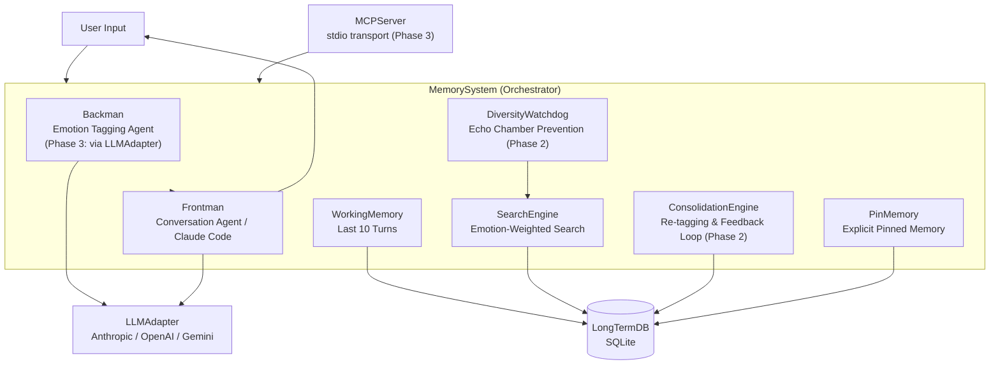

# Amygdala — Give Your LLM the Power to Remember

**Simplified Amygdala Emulation — Emotion-based memory augmentation for LLMs**

[](README_ja.md)
[](LICENSE)
[]()
[]()

---

## Sound familiar?

> "We talked about this yesterday" → Claude: "I'm sorry, I don't have access to previous conversations."

> Used `/clear` and lost everything. Starting from scratch again.

> In a long coding session, the AI has forgotten the design decisions made at the beginning.

**Amygdala solves this.**

Whether the session ends, you run `/clear`, or days pass — your AI remembers the context of your conversations. And not just keyword matching: **emotionally significant conversations leave stronger memories**, just like the human brain.

---

## Before / After

| | Before (plain Claude Code) | After (with Amygdala) |
|---|---|---|
| After `/clear` | Everything forgotten. Start from zero. | Long-term memory DB is searched for emotionally relevant memories; conversation continues seamlessly. |
| Session disconnect | Working memory lost. | Last 10 turns are persisted in SQLite. Carried over to the next session. |
| Conversation from 3 days ago | Does not exist. | "That project thing" is enough to recall it. |
| Important decisions | Must be re-explained every time. | Pinned in PinMemory. Remembered without asking. |
| Recurring preferences / policies | Must be explained every time. | Learned through use; reflected naturally. |
| Long sessions | Early context fades (Lost in the Middle). | Emotionally important exchanges act as anchors. |

---

## Amygdala in 30 Seconds

```
You: "Spent 3 weeks on that project, presented it, got no reaction..."
   → Amygdala stores: sadness 0.6 / importance 0.9 / scene: work

(3 days later, different session)
You: "How should I prepare for the next presentation?"
   → Previous presentation experience recalled via emotional similarity
   → AI generates advice informed by that past experience
```

```
You: "Remember this: always go through staging before deploying"
   → Registered in PinMemory (max 3 slots)

(20 turns later)
You: "Can I push to production?"
   → PinMemory auto-referenced: "You have a rule about going through staging first."
```

---

## Key Features

### Emotion-Based Memory Retrieval
Memories are searched not by text similarity, but by a **10-axis emotion vector** (joy, anger, surprise, etc.). "That time it was really tough" surfaces emotionally similar memories.

### Memory That Persists Across Sessions
Even after `/clear` or session disconnect, memories stored in the long-term DB remain. Working memory is also persisted to SQLite, so context carries over to the next session.

### Pin Memory (3 Slots)
Say "remember this" to anchor important information. Every 10 turns the system checks: "Still need this?" If released, the memory is transferred to long-term storage with high priority.

### Echo Chamber Prevention
DiversityWatchdog monitors for repetitive recall of the same memories. When imbalance is detected, memories from other categories are automatically injected.

### Gets Smarter the More You Use It
The system tracks whether memories recalled by the AI are actually used. Used memories are reinforced; ignored ones gradually fade out.

---

## Architecture



### Processing Flow

```
User Input
    │
    ▼
Backman: Emotion + Scene Tagging (10-axis vector generation)
    │
    ▼
SearchEngine: Long-term memory retrieval (emotion × scene × time)
    │
    ▼
DiversityWatchdog: Diversity injection (echo chamber prevention)
    │
    ▼
Frontman: Context assembly + response generation
    │
    ▼
WorkingMemory update → transfer to long-term memory after 10 turns
    │
    ▼
Feedback loop: update memory weights based on reference history
```

### Dual-Agent Structure

| Agent | Role |
|---|---|
| **Backman** | Behind the scenes: emotion tagging, memory retrieval, feedback evaluation, diversity monitoring |
| **Frontman** | Front stage: handles user dialogue; responds based on the context assembled by Backman |

Since Backman handles only emotion analysis, a lightweight model (e.g., Haiku) is sufficient.

### Two-Tier Memory

| Tier | Biological Analogy | Function |
|---|---|---|
| **Working Memory** | Prefrontal cortex | Stores last 10 turns verbatim (persisted in SQLite). No compression. |
| **Long-Term Memory** | Hippocampus → Neocortex | Permanent storage of emotion+scene-tagged memories. No physical deletion. |

### 3-Axis Tagging

| Axis | Dimensions | Details |
|---|---|---|
| **Emotion** | 10 axes | joy / sadness / anger / fear / surprise / disgust / trust / anticipation + importance / urgency |
| **Scene** | 8 tags | work / relationship / hobby / health / learning / daily / philosophy / meta |
| **Time** | Decay function | `0.5^(days / half_life)` — more recent memories are weighted higher |

---

## Setup

### 1. Installation

```bash
git clone https://github.com/NOBI327/amygdala.git
cd amygdala
pip install -r requirements.txt
pip install mcp  # required for MCP server
```

### 2. Set Your API Key (Optional)

Amygdala supports two operating modes:

| Mode | Setup | Emotion Tagging |
|---|---|---|
| **Claude Code mode** | No API key needed | Claude Code provides emotion scores via `emotions` parameter (auto-tagging disabled) |
| **API mode** | Set `ANTHROPIC_API_KEY` | Backman auto-tags emotions internally (lower latency) |

To enable API mode:

```bash
# Add to your shell config (.bashrc / .zshrc / etc.)
export ANTHROPIC_API_KEY="sk-ant-..."
```

> **Technical note (for integrators)**: In Claude Code mode, the MCP server cannot auto-tag emotions internally. Claude Code reads the tool descriptions and automatically provides `emotions` scores based on conversation context — no user action is required. If you are building a custom client that calls these MCP tools directly, you must provide the `emotions` parameter yourself.

> **Security Note**
> - Manage your API key via environment variables. Direct inclusion in config files (`.claude.json`, etc.) is **not recommended**.
> - If you use a `.env` file, make sure it is listed in `.gitignore`.
> - This repository's `.gitignore` already includes `.env` and `.claude.json`.

### 3. Register the MCP Server with Claude Code

**Option A: CLI command (recommended)**

```bash
claude mcp add emotion-memory \
  -e ANTHROPIC_API_KEY=$ANTHROPIC_API_KEY \
  --scope user \
  -- python -m src.mcp_server
```

Using `--scope user` makes Amygdala available from any project. Switch to `--scope local` to limit it to a specific project.

**Option B: Edit the config file directly**

Claude Code (`~/.claude/settings.json`):

```json
{
  "mcpServers": {
    "emotion-memory": {
      "command": "python",
      "args": ["-m", "src.mcp_server"],
      "cwd": "/path/to/amygdala"
    }
  }
}
```

Claude Desktop (`claude_desktop_config.json`):

```json
{
  "mcpServers": {
    "emotion-memory": {
      "command": "python",
      "args": ["-m", "src.mcp_server"],
      "cwd": "/path/to/amygdala"
    }
  }
}
```

> **Note**: Do not write API keys directly into config files. Pass them via environment variable using `-e ANTHROPIC_API_KEY=$ANTHROPIC_API_KEY` (CLI) or by pre-setting `export` in your shell.

### 4. Verify Connection

```bash
claude          # Launch Claude Code
/mcp            # Check MCP connection status
```

If you see `emotion-memory: connected`, you're good to go.

### 5. Bulk Permission Setup (Recommended)

By default, Claude Code asks for confirmation each time an Amygdala tool is called. To approve all 6 tools at once with a description of each, run:

```bash
python setup_permissions.py
```

```
============================================================
  Emotion Memory System — Feature List
============================================================

  1. Store Memory
     Tag text with emotion scores (10 axes: joy, trust, etc.) and save to DB.

  2. Recall Memories
     Search and retrieve relevant memories by emotional similarity.

  3. Stats
     Return system statistics: total memories, emotion distribution, diversity index.

  4. Pin Memory
     Pin important information to working memory (max 3 slots).

  5. Unpin Memory
     Release a pin and migrate it to long-term memory.

  6. List Pinned Memories
     Show currently pinned memories with their TTL remaining.

Approve all? [Y/n]: y
→ Done. All tools registered in .claude/settings.local.json.
```

This only needs to be run once per project.

### Environment Variables

| Variable | Default | Description |
|---|---|---|
| ANTHROPIC_API_KEY | (optional) | Anthropic API key. If unset, auto-tagging is disabled; pass `emotions` explicitly |
| EMS_BACKMAN_MODEL | claude-haiku-4-5-20251001 | Backman model |
| EMS_FRONTMAN_MODEL | claude-haiku-4-5-20251001 | Frontman model |
| EMS_DB_PATH | memory.db | SQLite DB file path |

### Troubleshooting

| Symptom | Cause | Fix |
|------|------|------|
| `/mcp` does not show `connected` | Incorrect path | Check that `cwd` points to the amygdala root directory |
| Emotion scores always 0 | `emotions` not provided and no API key | Pass `emotions` dict explicitly in `store_memory` calls, or set `ANTHROPIC_API_KEY` for auto-tagging |
| Tools not listed | Claude Code is outdated | Run `claude update` to upgrade |
| Memories not recalled | DB is empty | First ~10 turns are the memory accumulation phase; it starts working after that |

---

## Usage

### MCP Tools (Claude Code Integration)

Once registered as an MCP server, Claude Code automatically selects the appropriate tool based on conversation context. You do not need to invoke tools explicitly.

```
# Store a memory (Claude Code decides when to save based on conversation)
store_memory: "Today's code review was great. I feel the team's trust has grown."

# Retrieve memories (by emotional similarity)
recall_memories: "Good things that happened at work recently"

# Check DB statistics
get_stats: {}
```

> **How it works**: Claude Code reads the MCP tool descriptions and calls them at appropriate moments based on conversation context. Just "have a normal conversation" and Amygdala works in the background — though the frequency and timing of tool calls are determined by Claude Code.

### Standalone Mode

```bash
python -m src.frontman
# or
python scripts/demo.py
```

---

## Technical Background

### Why Emotion?

Traditional LLM memory (RAG, MemGPT, etc.) relies solely on text semantic similarity and **has no basis for judging what is important**. In the human brain, the amygdala and hippocampus use "emotion" to evaluate and associate memory importance. This system borrows that biological mechanism as an engineering pattern.

### Re-tagging (Reconsolidation)

Each time a memory is recalled, only its emotional **intensity** is adjusted (direction is preserved). This corresponds to the neuroscientific concept of memory reconsolidation.

**Important:** Emotion vector blending (mixing) is not performed. Simulations in v0.4 confirmed that blending causes all memories' emotions to converge to the mean over iterations, collapsing retrieval resolution.

### Background on Design Decisions

This system originally attempted to implement constant gravitational attraction between memories via N-body simulation ("emotion gravity field"). After 7 simulations:

| Attempted Approach | Reason for Rejection |
|---|---|
| Constant N-body simulation | Black hole effect (all memories converge to one point) |
| Lennard-Jones equilibrium model | Spheroidization (loss of associative retrieval) |
| Emotion vector blending | Iterative convergence of all vectors to mean |

Lesson: Associative recall should be treated not as a constant physical force, but as **an event that occurs only at retrieval time**.

See [proposal v0.4](docs/emotion-memory-system-proposal-v0.4.md) for details.

---

## Implementation Status

| Phase | Content | Tests | Status |
|---|---|---|---|
| Phase 1 | MVP — DB / Backman / Frontman / WorkingMemory / PinMemory / SearchEngine / Config / MemorySystem | 77 PASS | Done |
| Phase 2 | Feedback loop + diversity control — DiversityWatchdog / ConsolidationEngine / implicit feedback | 108 PASS | Done |
| Phase 3 | MCP server + multi-provider LLM — LLMAdapter / MCPServer | 138 PASS | Done |
| Phase 4 | API-keyless delegation + security hardening + README overhaul + eval infrastructure | 147 PASS | Done |

### Directory Structure

```
amygdala/
├── src/
│   ├── config.py             # Configuration (DI container)
│   ├── db.py                 # DatabaseManager (SQLite)
│   ├── backman.py            # BackmanService (emotion tagging)
│   ├── frontman.py           # FrontmanService (response generation)
│   ├── working_memory.py     # WorkingMemory (last 10 turns)
│   ├── pin_memory.py         # PinMemory (explicit pinned memory)
│   ├── search_engine.py      # SearchEngine (emotion-weighted search)
│   ├── reconsolidation.py    # ConsolidationEngine (Phase 2)
│   ├── diversity_watchdog.py # DiversityWatchdog (Phase 2)
│   ├── llm_adapter.py        # LLMAdapter (Phase 3: multi-provider)
│   ├── mcp_server.py         # MCPServer (Phase 3: stdio transport)
│   └── memory_system.py      # MemorySystem (orchestrator)
├── scripts/
│   ├── init_db.py
│   ├── demo.py
│   ├── label_tool.py          # Feedback accuracy labeling tool (Phase 4)
│   ├── run_labeling.sh        # Labeling workflow runner (Phase 4)
│   ├── export_recall_log.py   # recall_log CSV exporter (Phase 4)
│   └── accuracy_report.py     # Accuracy report generator (Phase 4)
├── tests/                    # 147 tests, 93% coverage
├── docs/
│   └── emotion-memory-system-proposal-v0.4.md
└── requirements.txt
```

### Running Tests

```bash
# All tests + coverage
python -m pytest tests/ -v --cov=src --cov-report=term-missing

# Core layer coverage check (80%+ required)
python -m pytest tests/ --cov=src --cov-fail-under=80
```

---

## Contributing / License

MIT License

Pull Requests are welcome. Bug reports and feature suggestions go to [GitHub Issues](https://github.com/NOBI327/amygdala/issues).
