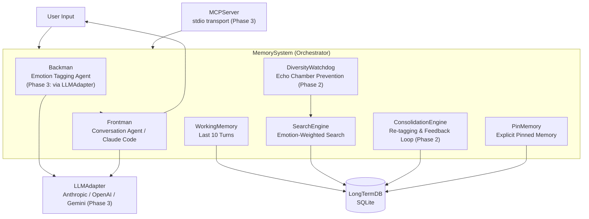

# Simplified Amygdala Emulation - An emotion-weighted memory augmentation for LLMs

[](README_ja.md)

**Simplified Amygdala Emulation** models memories as multi-dimensional vectors weighted by 10 emotional axes.
It enables long-term memory for LLMs via multi-axis search (emotion × scene × time) and integrates with Claude Code as an MCP server.

MIT License / OSS

---

## Why Emotion-Based Memory is Revolutionary

Traditional LLM memory retrieves memories only by text similarity. Human memory, however, is anchored not just to emotions, but to scenes and time.

This system encodes memories as multi-dimensional vectors across **three axes**:

| Axis | Dimensions | Details |
|------|-----------|---------|
| **Emotion** | 10 axes | joy / sadness / anger / fear / surprise / disgust / trust / anticipation + importance / urgency |
| **Scene** | 8 tags | work / relationship / hobby / health / learning / daily / philosophy / meta |
| **Time** | decay function | `0.5 ^ (days / half_life)` — recent memories are weighted more heavily |

During recall, the composite score combines all three axes, allowing the system to surface memories that are emotionally relevant, contextually appropriate, and temporally recent.

In addition, the **DiversityWatchdog** (Phase 2) prevents echo chambers (repeated retrieval of the same memory),
and the feedback loop reinforces memories that are actually referenced.

---

## Architecture



### Processing Flow

```
User Input
    │
    ▼
Backman: Emotion + Scene Tagging (10-axis vector generation)
    │
    ▼
SearchEngine: Long-term memory retrieval (emotion × scene × time)
    │
    ▼
DiversityWatchdog: Diversity injection (echo chamber prevention)
    │
    ▼
Frontman: Context prompt assembly + response generation
    │
    ▼
WorkingMemory update → transfer to long-term memory after 10 turns
    │
    ▼
Feedback loop: update memory weights based on reference history
```

### Working Memory

Modeled after the **prefrontal cortex working memory**, the `WorkingMemory` module stores the last 10 conversation turns verbatim in a FIFO buffer:

- **Raw storage**: user input and AI response are preserved as-is (no compression)
- **FIFO eviction**: when the 10-turn limit is reached, the oldest turn is evicted
- **Transfer to long-term memory**: evicted turns are passed to Backman for emotion tagging, then stored in the SQLite long-term DB
- **Always fresh context**: the working memory always holds the most recent conversation context

This two-tier design mirrors biological memory — short-term buffers provide immediate context, while long-term storage accumulates semantically enriched memories.

### Pin Memory

The `PinMemory` module lets users explicitly anchor information into a maximum of **3 slots**, modeled after the **active maintenance** function of the prefrontal cortex:

- **Explicit pinning**: triggered by keywords such as "remember this", "don't forget", "pin this"
- **TTL-based expiry**: each pin has a turn-count TTL; when expired, the system prompts the user to confirm renewal or release
- **Slot release**: released pins are transferred to long-term memory with elevated relevance score (`2.0`)
- **Priority in recall**: pinned memories use an extended half-life, keeping them highly weighted in search

---

## Installation

```bash
git clone https://github.com/NOBI327/amygdala.git
cd amygdala
pip install -r requirements.txt
pip install mcp  # required for MCP server
export ANTHROPIC_API_KEY=your_key
```

### Environment Variables

| Variable | Default | Description |
|----------|---------|-------------|
| ANTHROPIC_API_KEY | (required) | Anthropic API key |
| EMS_BACKMAN_MODEL | claude-haiku-4-5-20251001 | Backman model |
| EMS_FRONTMAN_MODEL | claude-haiku-4-5-20251001 | Frontman model |
| EMS_DB_PATH | memory.db | SQLite DB file path |

---

## MCP Setup

This system can be used as an MCP server from Claude Code.

### Claude Code (~/.claude/settings.json)

```json
{
  "mcpServers": {
    "emotion-memory": {
      "command": "python",
      "args": ["-m", "src.mcp_server"],
      "cwd": "/path/to/amygdala"
    }
  }
}
```

### Claude Desktop (claude_desktop_config.json)

```json
{
  "mcpServers": {
    "emotion-memory": {
      "command": "python",
      "args": ["-m", "src.mcp_server"],
      "cwd": "/path/to/amygdala"
    }
  }
}
```

After configuration, restart Claude Code / Claude Desktop to activate the MCP tools.

---

## Usage

### MCP Tool Calls (Claude Code Integration)

```
# Store a memory
store_memory: "Today's code review went great. I feel the team's trust has grown."

# Retrieve memories (by emotional similarity)
recall_memories: "Good things that happened at work recently"

# Check DB statistics
get_stats: {}
```

### Standalone Mode

```bash
# Interactive demo
python -m src.frontman

# Or
python scripts/demo.py
```

Example session:

```
You: Remember this: my birthday is March 15
AI: Got it. Saved to pin memory.

You: About that birthday thing earlier...
AI: You mean March 15th, your birthday. [Response referencing the memory]
```

---

## Implementation Status (Phase 1–3)

| Phase | Content | Tests | Status |
|-------|---------|-------|--------|
| Phase 1 | MVP (8 modules: DB/Backman/Frontman/WorkingMemory/PinMemory/SearchEngine/Config/MemorySystem) | 77 PASS | Done |
| Phase 2 | Feedback loop + diversity control (DiversityWatchdog/ConsolidationEngine/implicit feedback) | 108 PASS | Done |
| Phase 3 | MCP server + multi-provider LLM (LLMAdapter/MCPServer) | — | Done |

### Directory Structure

```
amygdala/
├── src/
│   ├── __init__.py
│   ├── config.py             # Configuration (DI container)
│   ├── db.py                 # DatabaseManager (SQLite)
│   ├── backman.py            # BackmanService (emotion tagging)
│   ├── frontman.py           # FrontmanService (response generation)
│   ├── working_memory.py     # WorkingMemory (last 10 turns)
│   ├── pin_memory.py         # PinMemory (explicit pinned memory)
│   ├── search_engine.py      # SearchEngine (emotion-weighted search)
│   ├── reconsolidation.py    # ConsolidationEngine (Phase 2)
│   ├── diversity_watchdog.py # DiversityWatchdog (Phase 2)
│   ├── llm_adapter.py        # LLMAdapter (Phase 3: multi-provider)
│   └── memory_system.py      # MemorySystem (orchestrator)
├── scripts/
│   ├── init_db.py            # DB initialization script
│   └── demo.py               # Interactive demo
├── tests/
│   ├── test_backman.py
│   ├── test_config.py
│   ├── test_db.py
│   ├── test_diversity_watchdog.py
│   ├── test_frontman.py
│   ├── test_memory_system.py
│   ├── test_pin_memory.py
│   ├── test_reconsolidation.py
│   ├── test_search_engine.py
│   └── test_working_memory.py
├── docs/
│   └── emotion-memory-system-proposal-v0.4.md
└── requirements.txt
```

### Running Tests

```bash
# All tests + coverage
python -m pytest tests/ -v --cov=src --cov-report=term-missing

# Core layer coverage check (80%+ required)
python -m pytest tests/ --cov=src --cov-fail-under=80
```

---

## Contributing / License

MIT License

Pull requests are welcome. Bug reports and feature suggestions go to GitHub Issues.

- Repository: https://github.com/NOBI327/amygdala
- Issues: https://github.com/NOBI327/amygdala/issues
