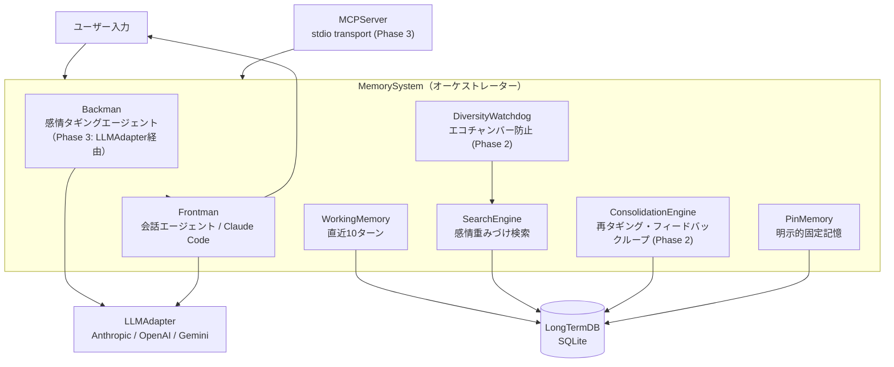

# Amygdala — LLMに「思い出す力」を与える

**Simplified Amygdala Emulation — 感情ベースのLLMメモリ拡張**

[](README.md)
[](LICENSE)
[]()
[]()

---

## こんな経験、ありませんか？

> 「昨日あの話したじゃん」→ Claude: 「申し訳ありませんが、以前の会話にはアクセスできません」

> `/clear` したら全部忘れた。また一から説明し直し。

> 長時間のコーディングセッション中、序盤で決めた設計方針をAIが忘れている。

**Amygdalaはこの問題を解決します。**

セッションが切れても、`/clear` しても、日が変わっても——あなたのAIは対話の文脈を覚えています。しかも、ただのキーワード検索ではなく、**感情的に重要だった会話ほど強く記憶に残る**、人間の脳に近い仕組みで。

---

## Before / After

| | Before (素のClaude Code) | After (Amygdala導入後) |
|---|---|---|
| `/clear` 後 | 全て忘却。ゼロからやり直し | 長期記憶DBから感情的に関連する記憶が自動検索され、会話を継続できる |
| セッション切断時 | ワーキングメモリ消失 | 直近10ターンはSQLiteに永続化済み。次回セッションで引き継がれる |
| 3日前の会話 | 存在しない | 「あのプロジェクトの件」で通じる |
| 重要な決定事項 | 毎回伝え直す必要あり | ピンメモリで固定。聞かなくても覚えている |
| 繰り返し話す好み・方針 | 毎回説明 | 使うほど学習され、自然に反映される |
| 長いセッション | 序盤の文脈が消える（Lost in the Middle） | 感情的に重要な会話がアンカーとして残る |

---

## 30秒で分かるAmygdala

```
あなた: 「3週間かけたプロジェクト、発表したけど反応なかった…」
   → Amygdala: sadness 0.6 / importance 0.9 / scene: work として記憶

（3日後、別のセッションで）
あなた: 「今度の発表、どう準備したらいいかな」
   → 前回の発表経験が感情的関連で自動想起
   → AIが前回の経験を踏まえたアドバイスを生成
```

```
あなた: 「これ覚えといて：デプロイは必ずステージング経由」
   → ピンメモリに登録（最大3枠）

（20ターン後）
あなた: 「本番にプッシュしていい？」
   → ピンメモリが自動参照：「ステージング経由のルールがありますね」
```

---

## 主な特徴

### 感情ベースの記憶検索
テキスト類似度ではなく、**喜び・怒り・驚き**など10軸の感情ベクトルで記憶を検索。「あの辛かった時の話」で、感情的に近い記憶が浮かび上がる。

### セッションを超える記憶
`/clear` やセッション切断後も、長期記憶DBに保存された記憶は消えない。ワーキングメモリもSQLiteに永続化されるため、次回セッション開始時に文脈を引き継げる。

### ピンメモリ（3枠）
「これ忘れないで」と言えば、重要な情報をワーキングメモリに固定。10ターンごとに「まだ必要？」と確認し、不要になれば高い重要度で長期記憶に移管。

### エコーチェンバー防止
同じ記憶ばかり繰り返し想起されるのを防ぐ多様性モニタリング。偏りが検知されると、別カテゴリの記憶を自動で混入させる。

### 使うほど賢くなる
AIが想起した記憶をあなたが実際に使ったかどうかを追跡。使われた記憶は強化され、無視された記憶は徐々にフェードアウト。

---

## アーキテクチャ



### 処理フロー

```
ユーザー入力
    │
    ▼
Backman: 感情+場面タグ付け（10軸ベクトル生成）
    │
    ▼
SearchEngine: 長期記憶検索（感情 × 場面 × 時間）
    │
    ▼
DiversityWatchdog: 多様性注入（エコーチェンバー防止）
    │
    ▼
Frontman: コンテキスト組立 + 応答生成
    │
    ▼
WorkingMemory更新 → 10ターン超過で長期記憶に移管
    │
    ▼
フィードバックループ: 参照履歴に基づき記憶の重みを更新
```

### Dual-Agent構造

| エージェント | 役割 |
|---|---|
| **Backman** | 裏方。感情タギング、記憶検索、フィードバック判定、多様性監視 |
| **Frontman** | 表舞台。ユーザーとの対話を担当。Backmanが組み立てたコンテキストに基づいて応答 |

Backmanは感情分析のみを担当するため、軽量モデル（Haiku等）で十分動作します。

### 2階層メモリ

| 層 | 生物学的対応 | 機能 |
|---|---|---|
| **ワーキングメモリ** | 前頭前皮質 | 直近10ターンを原文保存（SQLiteに永続化）。圧縮なし |
| **長期記憶** | 海馬→新皮質 | 感情+場面でタグ付けされた記憶の永久保存。物理削除なし |

### 3軸タギング

| 軸 | 次元 | 内容 |
|---|---|---|
| **感情** | 10軸 | joy / sadness / anger / fear / surprise / disgust / trust / anticipation + importance / urgency |
| **場面** | 8タグ | work / relationship / hobby / health / learning / daily / philosophy / meta |
| **時間** | 減衰関数 | `0.5^(days / half_life)` — 新しい記憶ほど高い重み |

---

## セットアップ

### 1. インストール

```bash
git clone https://github.com/NOBI327/amygdala.git
cd amygdala
pip install -r requirements.txt
pip install mcp  # MCPサーバー使用時
```

### 2. APIキーの設定（任意）

Amygdalaは2つの動作モードに対応しています:

| モード | 設定 | 感情タギング |
|---|---|---|
| **Claude Codeモード** | APIキー不要 | Claude Codeが `emotions` パラメータで感情スコアを明示渡し（自動タギング無効） |
| **APIモード** | `ANTHROPIC_API_KEY` を設定 | Backmanが内部で自動タギング（低レイテンシ） |

APIモードを有効にする場合:

```bash
# シェルの設定ファイルに追記（.bashrc / .zshrc 等）
export ANTHROPIC_API_KEY="sk-ant-..."
```

> **Claude Codeモードの注意**: APIキーなしで運用する場合、`store_memory` や `recall_memories` 呼び出し時に `emotions` を必ず明示的に渡してください。Claude Code自身が適切な感情スコアを判定できます。`emotions` を省略するとゼロベクターで保存され、検索精度が低下します。

> **セキュリティ上の注意**
> - APIキーは環境変数で管理してください。設定ファイル（`.claude.json` 等）への直接記載は**非推奨**です
> - `.env` ファイルを使用する場合は `.gitignore` に含まれていることを確認してください
> - 本リポジトリの `.gitignore` には `.env` と `.claude.json` が含まれています

### 3. Claude CodeにMCPサーバーを登録

**方法A: CLIコマンド（推奨）**

```bash
claude mcp add emotion-memory \
  -e ANTHROPIC_API_KEY=$ANTHROPIC_API_KEY \
  --scope user \
  -- python -m src.mcp_server
```

`--scope user` をつけると、どのプロジェクトからでもAmygdalaが使える。特定プロジェクトだけで使いたい場合は `--scope local` に変更。

**方法B: 設定ファイルを直接編集**

Claude Code（`~/.claude/settings.json`）:

```json
{
  "mcpServers": {
    "emotion-memory": {
      "command": "python",
      "args": ["-m", "src.mcp_server"],
      "cwd": "/path/to/amygdala"
    }
  }
}
```

Claude Desktop（`claude_desktop_config.json`）:

```json
{
  "mcpServers": {
    "emotion-memory": {
      "command": "python",
      "args": ["-m", "src.mcp_server"],
      "cwd": "/path/to/amygdala"
    }
  }
}
```

> **注意**: APIキーは設定ファイルに直接書かず、環境変数経由で渡してください。`-e ANTHROPIC_API_KEY=$ANTHROPIC_API_KEY`（CLI）または事前に `export` で設定した環境変数を参照する形が安全です。

### 4. 接続確認

```bash
claude          # Claude Code起動
/mcp            # MCP接続状態を確認
```

`emotion-memory: connected` と表示されればOK。

### 5. 一括パーミッション設定（推奨）

デフォルトではClaude CodeがAmygdalaのツールを呼ぶたびに確認が求められます。全6機能を一度に許可するには:

```bash
python setup_permissions.py
```

```
============================================================
  感情メモリシステム (Emotion Memory) — 機能一覧
============================================================

  1. 記憶の保存
     テキストに感情タグ（joy, trust等10軸）を付与してDBに保存する。

  2. 記憶の検索
     感情ベースでDBから関連する記憶を検索・取得する。

  3. 統計情報
     記憶の総数、感情分布、多様性指数などのシステム統計を返す。

  4. ピン固定
     重要な情報をワーキングメモリにピン止めする（最大3スロット）。

  5. ピン解除
     ピンを解除し、長期記憶へ移管する。

  6. ピン一覧
     現在ピン止めされている記憶の一覧とTTL残数を表示する。

全機能を許可しますか？ [Y/n]: y
→ セットアップ完了。以降は確認なしで全機能が使える。
```

プロジェクトごとに1回だけ実行すればOKです。

### 環境変数一覧

| 変数名 | デフォルト | 説明 |
|---|---|---|
| ANTHROPIC_API_KEY | (任意) | Anthropic APIキー。未設定時は自動タギング無効、`emotions` の明示渡しを推奨 |
| EMS_BACKMAN_MODEL | claude-haiku-4-5-20251001 | Backmanモデル |
| EMS_FRONTMAN_MODEL | claude-haiku-4-5-20251001 | Frontmanモデル |
| EMS_DB_PATH | memory.db | SQLite DBファイルパス |

### トラブルシューティング

| 症状 | 原因 | 対処 |
|------|------|------|
| `/mcp` で connected にならない | パスが間違っている | `cwd` がamygdalaのルートディレクトリを指しているか確認 |
| 感情スコアが常に0 | `emotions` 未提供かつAPIキーなし | `store_memory` で `emotions` dictを明示的に渡すか、`ANTHROPIC_API_KEY` を設定して自動タギングを有効化 |
| ツールが表示されない | Claude Codeが古い | `claude update` で最新版に更新 |
| 記憶が想起されない | DBが空 | 最初の10ターン程度は記憶蓄積期間。使い続けると機能し始める |

---

## 使い方

### MCPツール（Claude Code統合時）

AmygdalaをMCPサーバーとして登録すると、Claude Codeが会話の文脈に応じて以下のツールを自動選択します。ユーザーが明示的にツールを呼ぶ必要はありません。

```
# 記憶を保存（会話中の重要な発言をClaude Codeが判断して保存）
store_memory: "今日のコードレビューは最高だった。チームの信頼が高まった気がする。"

# 記憶を検索（感情的類似度で検索）
recall_memories: "最近の仕事で良かったこと"

# DB統計を確認
get_stats: {}
```

> **仕組み**: Claude CodeはMCPツールの説明文を読み、会話の文脈から適切なタイミングでツールを呼び出します。「普通に会話する」だけで裏側でAmygdalaが動きますが、ツール呼び出しの頻度や判断はClaude Code側に委ねられます。

### スタンドアロンモード

```bash
python -m src.frontman
# または
python scripts/demo.py
```

---

## 技術的な背景

### なぜ感情なのか

従来のLLMメモリ（RAG, MemGPT等）はテキストの意味的類似度のみに依存し、**「何が重要か」の判断基準を持たない**。人間の脳では扁桃体と海馬が「感情」を通じて記憶の重要度を判別・連想する。本システムはこの生物学的メカニズムをエンジニアリングパターンとして借用した。

### 再タギング（Reconsolidation）

記憶が想起されるたびに、感情の**強度のみ**を調節する（方向は保存）。これは脳科学の記憶再固定化に対応する。

**重要:** 感情ベクトルのブレンディング（混合）は行わない。v0.4のシミュレーションで、ブレンディングは反復により全記憶の感情が平均に収束し、検索解像度が崩壊することが確認された。

### 設計判断の背景

本システムは当初「感情重力場」として、記憶間に常時作用する引力をN体シミュレーションで実装しようとした。7回のシミュレーションの結果:

| 試みたアプローチ | 棄却理由 |
|---|---|
| 常時N体シミュレーション | ブラックホール化（全記憶が一点に収束） |
| レナード・ジョーンズ平衡モデル | 当球化（連想検索機能の喪失） |
| 感情ベクトルブレンディング | 反復で全ベクトルが平均に収束 |

教訓: 記憶間の連想は「常時作動する物理的力」ではなく「**検索時点にのみ発生するイベント**」として処理すべき。

詳細は [企画書 v0.4](docs/emotion-memory-system-proposal-v0.4.md) を参照。

---

## 実装状況

| Phase | 内容 | テスト | 状態 |
|---|---|---|---|
| Phase 1 | MVP — DB / Backman / Frontman / WorkingMemory / PinMemory / SearchEngine / Config / MemorySystem | 77件 PASS | 完了 |
| Phase 2 | フィードバックループ + 多様性制御 — DiversityWatchdog / ConsolidationEngine / 暗黙的フィードバック | 108件 PASS | 完了 |
| Phase 3 | MCPサーバー + マルチプロバイダLLM — LLMAdapter / MCPServer | 138件 PASS | 完了 |
| Phase 4 | APIキーレス委任 + 保安強化 + README改訂 + フィードバック実測基盤 | 147件 PASS | 完了 |

### ディレクトリ構成

```
amygdala/
├── src/
│   ├── config.py             # 設定（DIコンテナ）
│   ├── db.py                 # DatabaseManager（SQLite）
│   ├── backman.py            # BackmanService（感情タギング）
│   ├── frontman.py           # FrontmanService（応答生成）
│   ├── working_memory.py     # WorkingMemory（直近10ターン）
│   ├── pin_memory.py         # PinMemory（明示的固定記憶）
│   ├── search_engine.py      # SearchEngine（感情重みづけ検索）
│   ├── reconsolidation.py    # ConsolidationEngine（Phase 2）
│   ├── diversity_watchdog.py # DiversityWatchdog（Phase 2）
│   ├── llm_adapter.py        # LLMAdapter（Phase 3: マルチプロバイダ）
│   ├── mcp_server.py         # MCPServer（Phase 3: stdio transport）
│   └── memory_system.py      # MemorySystem（オーケストレーター）
├── scripts/
│   ├── init_db.py
│   ├── demo.py
│   ├── label_tool.py          # フィードバック精度ラベリングツール（Phase 4）
│   ├── run_labeling.sh        # ラベリング実行スクリプト（Phase 4）
│   ├── export_recall_log.py   # recall_log CSVエクスポーター（Phase 4）
│   └── accuracy_report.py     # 精度レポート自動生成（Phase 4）
├── tests/                    # 147テスト、93%カバレッジ
├── docs/
│   └── emotion-memory-system-proposal-v0.4.md
└── requirements.txt
```

### テスト実行

```bash
# 全テスト + カバレッジ
python -m pytest tests/ -v --cov=src --cov-report=term-missing

# Core層カバレッジ確認（80%以上必須）
python -m pytest tests/ --cov=src --cov-fail-under=80
```

---

## Contributing / License

MIT License

Pull Requestは歓迎です。バグ報告・機能提案は [GitHub Issues](https://github.com/NOBI327/amygdala/issues) へ。
