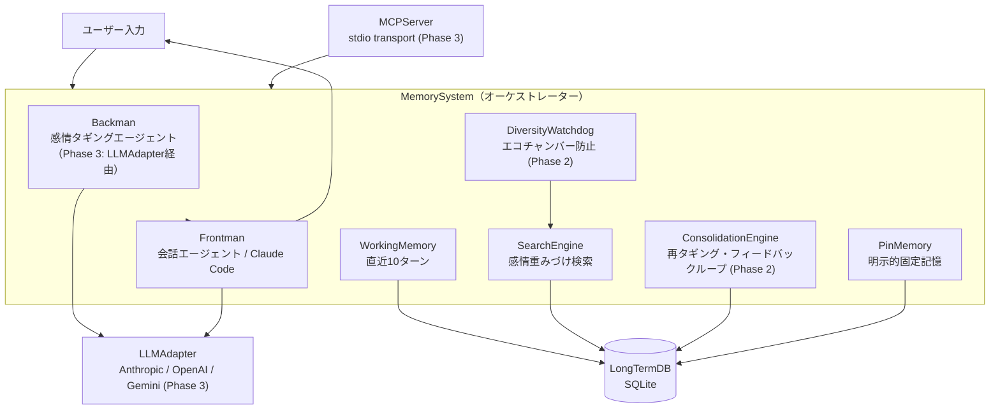

# 簡易扁桃体模倣型LLMメモリ拡張システム

**Simplified Amygdala Emulation**

[](README.md)

感情10軸・シーン8軸・時間減衰の3軸検索でLLMに長期記憶を与えるシステム。
Dual-Agent構造（Backman + Frontman）とMCPサーバーにより、Claude Codeと統合可能。

MIT License / OSS

---

## なぜ感情×場面×時間が革新的か

従来のLLMメモリは「テキスト類似度」でしか記憶を検索できない。人間の記憶は感情・場面・時間で立体的に結びついている。
このシステムは**3軸構造**で記憶を多次元ベクトル化し、人間の記憶想起に近い検索を実現する。

### 3軸構造

| 軸 | 詳細 |
|----|------|
| **感情軸（10軸）** | joy / sadness / anger / fear / surprise / disgust / trust / anticipation（8感情）+ importance / urgency（重要度・緊急度） |
| **シーン軸（8シーン）** | work / relationship / hobby / health / learning / daily / philosophy / meta |
| **時間軸** | 半減期ベースの時間減衰: `0.5 ** (days_ago / half_life)`（頻繁に参照された記憶ほど半減期が長い） |

ストーリー: 「人間の記憶は感情だけでなく、場面と時間にも紐づく」

さらにDiversityWatchdog（Phase 2）がエコーチェンバー（同一記憶の反復参照）を防ぎ、
フィードバックループが実際に活用された記憶を強化する。

---

## アーキテクチャ図



### 処理フロー

```
ユーザー入力
    │
    ▼
Backman: 感情+場面タグ付け（10軸ベクトル生成）
    │
    ▼
SearchEngine: 長期記憶検索（感情×場面×時間）
    │
    ▼
DiversityWatchdog: 多様性注入（エコチャンバー防止）
    │
    ▼
Frontman: コンテキストプロンプト組立 + 応答生成
    │
    ▼
WorkingMemory更新 → 10ターン超過で長期記憶に移管
    │
    ▼
フィードバックループ: 参照履歴に基づき記憶重みを更新
```

---

## メモリ構造

### ワーキングメモリ（WorkingMemory）

前頭前皮質のワーキングメモリに対応する短期バッファ。

- **直近10ターン**の会話を原文のまま保存（FIFOバッファ）
- 常に最新の文脈を保持し、Frontmanはこれをプロンプトに組み込む
- **10ターン満了時**: 溢れた古いターンをBackmanで感情タギング → 圧縮 → 長期記憶DB（SQLite）に移管
- SQLiteの`working_memory`テーブルに永続化されるため、セッション再起動後も継続

### ピンメモリ（PinMemory）

前頭前皮質の能動的維持（Active Maintenance）に対応する明示的固定記憶。

- ユーザーが「覚えといて」「忘れないで」などのキーワードで明示指定した情報を保持
- **最大3スロット**（スロット満杯時は新規登録不可、既存ピンを解除してから登録）
- **TTL付き**（10ターン経過で期限切れ通知 → ユーザーが更新または解除を選択）
- 解除時は長期記憶DBに移管（`pinned_flag=True`, `relevance_score=2.0` で高優先度）

---

## インストール手順

```bash
git clone https://github.com/NOBI327/amygdala.git
cd amygdala
pip install -r requirements.txt
pip install mcp  # MCPサーバー使用時
export ANTHROPIC_API_KEY=your_key
```

### 環境変数

| 変数名 | デフォルト | 説明 |
|--------|-----------|------|
| ANTHROPIC_API_KEY | (必須) | Anthropic APIキー |
| EMS_BACKMAN_MODEL | claude-haiku-4-5-20251001 | Backmanモデル |
| EMS_FRONTMAN_MODEL | claude-haiku-4-5-20251001 | Frontmanモデル |
| EMS_DB_PATH | memory.db | SQLiteDBファイルパス |

---

## MCP設定例

Claude Codeから本システムをMCPサーバーとして利用できる。

### Claude Code（~/.claude/settings.json）

```json
{
  "mcpServers": {
    "emotion-memory": {
      "command": "python",
      "args": ["-m", "src.mcp_server"],
      "cwd": "/path/to/amygdala"
    }
  }
}
```

### Claude Desktop（claude_desktop_config.json）

```json
{
  "mcpServers": {
    "emotion-memory": {
      "command": "python",
      "args": ["-m", "src.mcp_server"],
      "cwd": "/path/to/amygdala"
    }
  }
}
```

設定後、Claude Code / Claude Desktopを再起動するとMCPツールが有効になる。

---

## 使用例

### MCPツール呼び出し（Claude Code統合時）

```
# 記憶を保存
store_memory: "今日は素晴らしいコードレビューだった。チームの信頼が高まった気がする。"

# 記憶を検索（感情的類似度で検索）
recall_memories: "最近の仕事で良かったこと"

# DB統計を確認
get_stats: {}
```

### スタンドアロンモード

```bash
# インタラクティブデモ
python -m src.frontman

# または
python scripts/demo.py
```

実行例:

```
You: これを覚えといて: 誕生日は3月15日
AI: 覚えました。ピンメモリに登録しました。

You: さっきの誕生日の件だけど...
AI: 3月15日のお誕生日の件ですね。[記憶を参照して応答]
```

---

## Phase 1-3 実装状況

| Phase | 内容 | テスト | 状態 |
|-------|------|--------|------|
| Phase 1 | MVP（8モジュール: DB/Backman/Frontman/WorkingMemory/PinMemory/SearchEngine/Config/MemorySystem） | 77件 PASS | 完了 |
| Phase 2 | フィードバックループ + 多様性制御（DiversityWatchdog/ConsolidationEngine/暗黙的フィードバック判定） | 108件 PASS | 完了 |
| Phase 3 | MCPサーバー化 + マルチプロバイダLLM（LLMAdapter/MCPServer） | — | 完了 |

### ディレクトリ構成

```
amygdala/
├── src/
│   ├── __init__.py
│   ├── config.py             # 設定値（DI用コンテナ）
│   ├── db.py                 # DatabaseManager（SQLite）
│   ├── backman.py            # BackmanService（感情タギング）
│   ├── frontman.py           # FrontmanService（応答生成）
│   ├── working_memory.py     # WorkingMemory（直近10ターン）
│   ├── pin_memory.py         # PinMemory（明示的固定記憶）
│   ├── search_engine.py      # SearchEngine（感情重みづけ検索）
│   ├── reconsolidation.py    # ConsolidationEngine（Phase 2）
│   ├── diversity_watchdog.py # DiversityWatchdog（Phase 2）
│   ├── llm_adapter.py        # LLMAdapter（Phase 3: マルチプロバイダ）
│   └── memory_system.py      # MemorySystem（オーケストレーター）
├── scripts/
│   ├── init_db.py            # DB初期化スクリプト
│   └── demo.py               # インタラクティブデモ
├── tests/
│   ├── test_backman.py
│   ├── test_config.py
│   ├── test_db.py
│   ├── test_diversity_watchdog.py
│   ├── test_frontman.py
│   ├── test_memory_system.py
│   ├── test_pin_memory.py
│   ├── test_reconsolidation.py
│   ├── test_search_engine.py
│   └── test_working_memory.py
├── docs/
│   └── emotion-memory-system-proposal-v0.4.md
└── requirements.txt
```

### テスト実行方法

```bash
# 全テスト + カバレッジ
python -m pytest tests/ -v --cov=src --cov-report=term-missing

# Core層カバレッジ確認（80%以上必須）
python -m pytest tests/ --cov=src --cov-fail-under=80
```

---

## Contributing / License

MIT License

Pull Requestは歓迎。バグ報告・機能提案はGitHub Issuesへ。

- Repository: https://github.com/NOBI327/amygdala
- Issues: https://github.com/NOBI327/amygdala/issues
